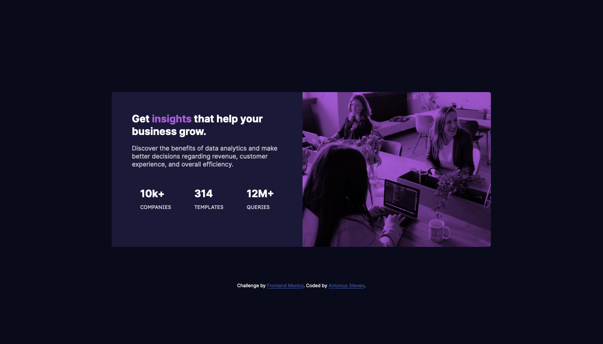

# Frontend Mentor - Stats preview card component solution

This is a solution to the [Stats preview card component challenge on Frontend Mentor](https://www.frontendmentor.io/challenges/stats-preview-card-component-8JqbgoU62). Frontend Mentor challenges help you improve your coding skills by building realistic projects.

## Table of contents

- [Overview](#overview)
  - [The challenge](#the-challenge)
  - [Screenshot](#screenshot)
  - [Links](#links)
- [My process](#my-process)
  - [Built with](#built-with)
  - [What I learned](#what-i-learned)
  - [Continued development](#continued-development)
  - [Useful resources](#useful-resources)
- [Author](#author)

## Overview

### The challenge

Users should be able to:

- View the optimal layout depending on their device's screen size

### Screenshot

### Links

- Solution URL: [Solution](https://github.com/ASteven21/Stats-Preview)
- Live Site URL: [Live Web](https://asteven21.github.io/Stats-Preview/)

## My process

### Built with

- Semantic HTML5 markup
- CSS custom properties
- Flexbox
- Mobile-first workflow

### What I learned

In this challenge I learned how to use the order property and the mix-blend-mode property. The mix-blend property is very interesting to me because I just knew that you could blend the image with the background color of your choosing.

### Continued development

I want to improve more on how to adjust the size of the image.

### Useful resources

- [@VernonDodo](https://www.frontendmentor.io/solutions/statspreviewcardcomponent-obPXYEVbB) - I learned about mix-blend-mode from looking at this gentleman's code.
- [w3schools](https://www.w3schools.com/csSref/css3_pr_order.asp) - I found out about the order property from this website.

## Author

- Website - [GitHub](https://github.com/ASteven21)
- Frontend Mentor - [@ASteven21](https://www.frontendmentor.io/profile/ASteven21)
